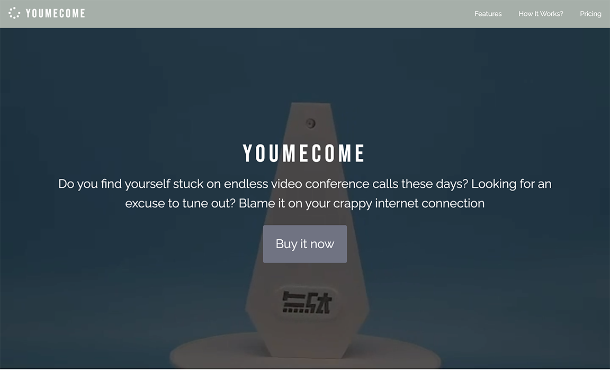
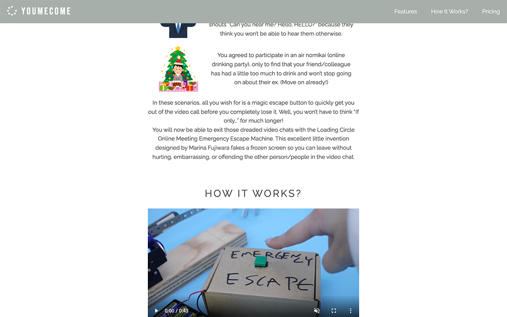
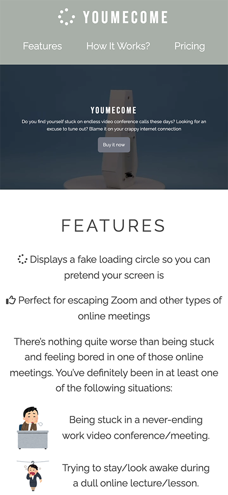
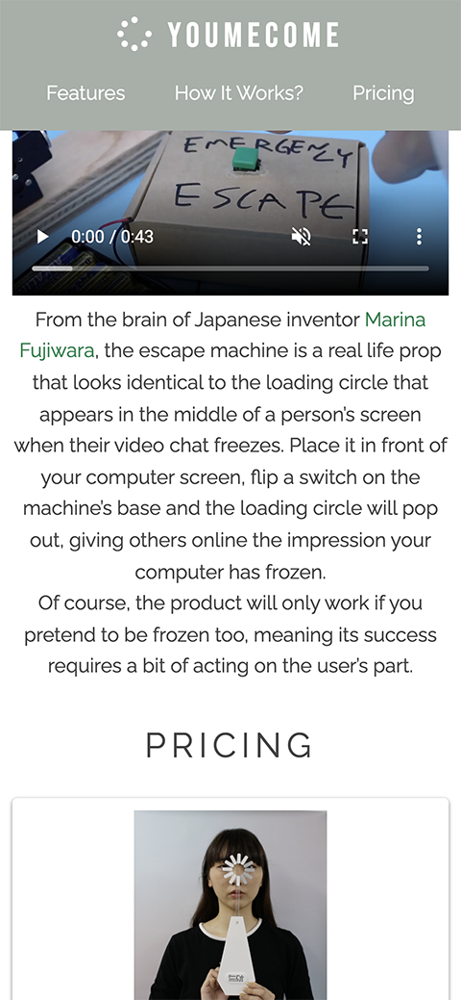

# YOUMECOME

A product landing page. This web page is one of my project for [Responsive Web Design Certification](https://www.freecodecamp.org/learn/responsive-web-design/) on [freeCodeCamp](https://www.freecodecamp.org/): [Build a Product Landing Page](https://www.freecodecamp.org/learn/responsive-web-design/responsive-web-design-projects/build-a-product-landing-page).

## Table of Content

- [Live Demo](#live-demo)
- [Final Product](#final-product)
- [Dependencies](#dependencies)
- [Getting Started](#getting-started)
- [Credit](#credit)

## Live demo

This app is built on [codepen](https://codepen.io/) and exported to distribute for this live demo:  
https://scc416.github.io/meyoucome/

## Final Product

|  |
| :--------------------------------------------: |
|           _The web page on desktop_            |

|  |
| :------------------------------------: |
|       _The web page on desktop_        |

|  |
| :----------------------------------: |
|       _The web page on mobile_       |

|  |
| :----------------------------------: |
|       _The web page on mobile_       |

## Dependencies

- [chota](https://jenil.github.io/chota/): CSS library

## Getting Started

1. Clone or download this repository onto your local device.
2. Open `index.html` with browser.

## Credit

- The actual product can be found [here](https://mudagostini.stores.jp/items/5eeb40a6561e175764cf1bc8).
- The web page of the inventor: [Marina Fujiwara](https://marinafujiwara.persona.co/).
- Article of the product on [OurWindsor.ca](https://www.ourwindsor.ca/opinion-story/10039859-emma-teitel-covid-19-is-not-the-only-ailment-in-this-pandemic-some-of-us-have-a-nasty-case-of-zoom-fatigue/).
- Article of the product on [Japan Trends](https://www.japantrends.com/video-call-emergency-escape-gadget-zoom/).
- favicons from [font-awesome](https://fontawesome.com/v5.15/icons/spinner), modified to animated gif by myself.